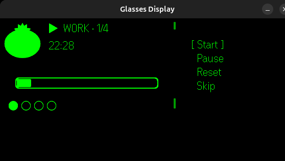
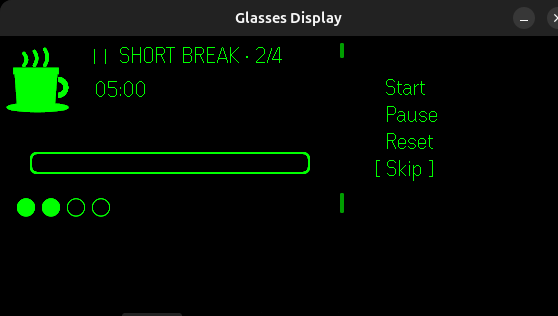

# Pomodoro G2

A Pomodoro technique timer for **Even Realities G2** smart glasses, built with the Even Hub SDK.




## Features

- **25-minute work sessions** with 5-minute short breaks and 15-minute long breaks
- **Pixel art icons** — tomato for work, coffee cup for break
- **Image-based progress bar** with rounded corners and fill animation
- **Session dots** tracking completed cycles (4 cycles before long break)
- **"Back to work!"** motivation message after each break (60 seconds)
- **Menu navigation** with Up/Down/Click on the G2 touchbar
- **Auto-advance** between work and break phases

## Controls

| Input | Action |
|-------|--------|
| **Up / Down** | Navigate menu (Start, Pause, Reset, Skip) |
| **Click** | Execute selected action |
| **Double Click** | Skip to next phase |

## Getting Started

### Prerequisites

- Node.js v20+
- Even Realities G2 glasses (or the evenhub-simulator for development)

### Install

```bash
git clone https://github.com/marceloleda/pomodoro-even-g2.git
cd pomodoro-even-g2
npm install
```

### Development

```bash
# Start dev server
npm run dev

# Run simulator (in another terminal)
npx evenhub-simulator http://localhost:5173
```

### Build & Package

```bash
npm run build
npx evenhub pack
```

## Tech Stack

- **TypeScript** + **Vite**
- **@evenrealities/even_hub_sdk** — G2 display and event bridge
- **@evenrealities/evenhub-simulator** — development preview
- **Canvas API** — pixel art icons and progress bar rendering

## Display Layout

```
[Tomato]  ▶  WORK · 1/4
           22:28              [ Start ]
                                Pause
[===========-------]            Reset
                                Skip
● ○ ○ ○
```

- **Left**: Icon (80x80 pixel art), status, timer, progress bar, session dots
- **Right**: Menu with `[ ]` selection indicator

## License

MIT
