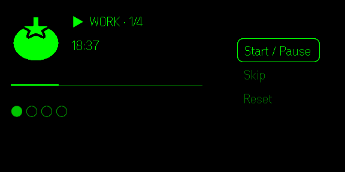
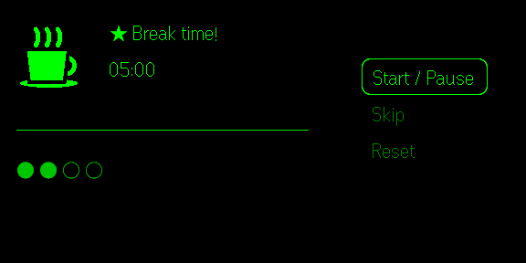

# Pomodoro G2

A Pomodoro technique timer for **Even Realities G2** smart glasses, built with the Even Hub SDK.




## Features

- **25-minute work sessions** with 5-minute short breaks and a 15-minute long break after every 4 sessions
- **Pixel art icons**: tomato for work, coffee cup for breaks
- **Text progress bar** (`━━━━────`) and **session dots** for the current set of 4
- **Phase-end alert**: the glasses have no speaker or haptics, so the status line blinks and the timer waits for you to start the next phase
- **Survives a locked phone and app restarts**: the timer runs on the wall clock and its state is saved on every change
- **Phone companion page** in the Even app with the same controls
- **Saves battery** by skipping display updates while the glasses are off your face

## Controls

| Input | Action |
|-------|--------|
| **Swipe up / down** | Move through the menu (Start / Pause, Skip, Reset) |
| **Tap** | Run the selected item |
| **Double tap** | Exit (system confirmation dialog) |

## Getting Started

### Prerequisites

- Node.js 20 LTS or 22+
- Even Realities G2 glasses (or the evenhub-simulator for development)

### Install

```bash
git clone https://github.com/marceloleda/pomodoro-even-g2.git
cd pomodoro-even-g2
npm install
```

### Development

```bash
# Start dev server
npm run dev

# Run the simulator (in another terminal)
npm run sim
```

`npm run sim` calls the simulator directly because `npx evenhub-simulator` fails: npm drops its `.bin` link, since its platform packages declare the same command name.

### Build & Package

```bash
npm run pack   # builds and writes pomodoro.ehpk, stamping min_app_version from SDK 0.0.16
```

Store listing text, icon, screenshots and the pre-submission checklist are in [`store/`](store/LISTING.md).

## Tech Stack

- **TypeScript** + **Vite**
- **@evenrealities/even_hub_sdk** (0.0.16): G2 display and event bridge
- **@evenrealities/evenhub-simulator**: development preview and screenshots
- **Canvas API**: icons, thresholded to on/off pixels

## Display Layout

```
[Tomato]  ▶  WORK · 1/4
          18:37             [Start / Pause]
                              Skip
━━━━━━────────────            Reset
● ○ ○ ○
```

- **Left**: icon (80x80), status, timer, progress bar, session dots
- **Right**: native list menu; the firmware draws the selection highlight

## License

MIT
