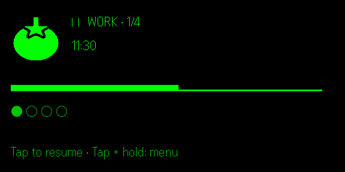
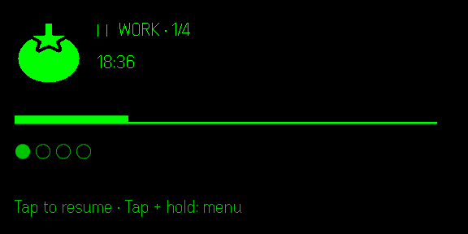
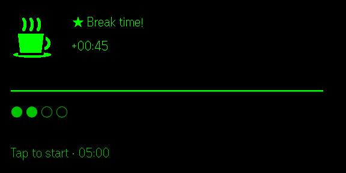
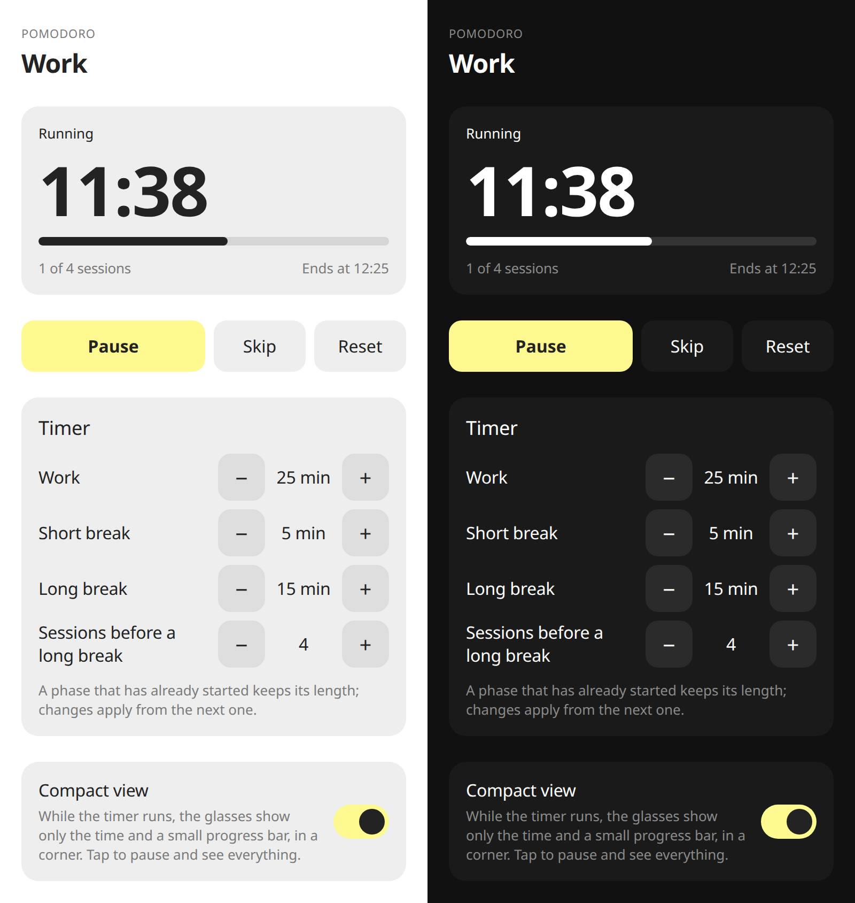

# Pomodoro G2

A Pomodoro technique timer for **Even Realities G2** smart glasses, built with the Even Hub SDK.

<p align="center">
  
</p>

<p align="center"><sub>Simulator recording: a tap starts the timer and the page fades to the compact view; a tap pauses and brings everything back.</sub></p>

## Features

- **25-minute work sessions** with 5-minute short breaks and a 15-minute long break after every 4 sessions, all adjustable on the phone
- **One tap to start or pause**; Skip and Reset live in the glasses' contextual menu
- **Pixel art icons**: tomato for work, coffee cup for breaks
- **Text progress bar** (`▄▄▄▄▁▁▁▁`), **session dots** and the clock time the phase **ends at**
- **Compact view**: while the timer runs, only the time and a mini progress bar stay on the glasses, dimmed in the top-right corner; the ▶ and the colon pulse with the seconds, and Start/Pause fade between the two pages. Pause to see everything (a switch on the phone turns it off)
- **Phase-end alert**: the glasses have no speaker or haptics, so the status line blinks (again every minute for 10 minutes) and the timer counts the extra time (`+02:13`) until you start the next phase
- **Survives a locked phone and app restarts**: the timer runs on the wall clock and its state is saved on every change
- **Phone companion page** in the Even app with the same controls and the timer settings
- **8 languages**: English, Spanish, French, German, Italian, Chinese, Japanese and Korean, picked from the phone's language
- **Saves battery** by skipping display updates while the glasses are off your face

## Screenshots

| Paused | Running (compact view) | Phase-end alert |
|:---:|:---:|:---:|
|  |  |  |

The phone page in the Even app mirrors the timer, has the same controls and holds the settings (light and dark theme):

<p align="center">
  
</p>

## Controls

| Input | Action |
|-------|--------|
| **Tap** | Start / pause (or start the next phase after an alert) |
| **Tap, then hold** | Contextual menu: Skip, Reset |
| **Swipe up / down** | Show the gestures in the footer |
| **Double tap** | Exit (system confirmation dialog) |

## Getting Started

### Prerequisites

- Node.js 20 LTS or 22+
- Even Realities G2 glasses (or the evenhub-simulator for development)

### Install

```bash
git clone https://github.com/marceloleda/pomodoro-even-g2.git
cd pomodoro-even-g2
npm install
```

### Development

```bash
# Start dev server
npm run dev

# Run the simulator (in another terminal)
npm run sim
```

`npm run sim` calls the simulator directly because `npx evenhub-simulator` fails: npm drops its `.bin` link, since its platform packages declare the same command name.

### Run on your glasses

1. Turn on Developer Mode in the Even Realities app.
2. Start the dev server: `npm run dev` (it listens on your local network).
3. In another terminal, make a QR code for your computer's LAN address (`hostname -I` on Linux, `ipconfig getifaddr en0` on macOS):

   ```bash
   npx evenhub qr --url "http://<your-lan-ip>:5173"
   ```

4. In the app's **Even Hub** tab, tap **Scan QR** and point the camera at the terminal. The app opens on the glasses, and saving a file updates it without scanning again.

The phone has to reach your computer on port 5173: if the scan doesn't connect, check the firewall, or Wi-Fi client isolation (a phone hotspot gets around it). In this mode, locking the phone suspends the WebView, so the locked-phone behavior is tested with a Beta build instead (see the [pre-submission checklist](store/LISTING.md#pre-submission-checklist)).

### Build & Package

```bash
npm run check:text   # every glasses string, in every language, fits its row and the G2 fonts
npm run pack         # builds and writes pomodoro.ehpk, stamping min_app_version from SDK 0.0.16
```

The app follows the device language. To preview a translation, point the simulator at `http://localhost:5173/?lang=de` (or any other supported code): `node node_modules/@evenrealities/evenhub-simulator/bin/index.js 'http://localhost:5173/?lang=de'`.

Store listing text, icon, screenshots and the pre-submission checklist are in [`store/`](store/LISTING.md).

## Tech Stack

- **TypeScript** + **Vite**
- **@evenrealities/even_hub_sdk** (0.0.16): G2 display and event bridge
- **@evenrealities/evenhub-simulator**: development preview and screenshots
- **Canvas API**: icons, thresholded to on/off pixels
- **@evenrealities/pretext**: checks text against the G2 firmware fonts (`npm run check:text`)

## Display Layout

```
[Tomato]  ▶  WORK · 1/4
          18:37
▄▄▄▄▄▄▄▁▁▁▁▁▁▁▁▁▁▁▁▁▁▁▁▁▁▁
● ○ ○ ○
Ends at 14:35
```

- Icon (80x80), status line, timer (or `+mm:ss` overtime after a phase ends), progress bar, session dots
- Footer: when the phase ends, or what a tap does while the timer waits
- The timer row captures input; Skip and Reset are in the system contextual menu

With the compact view on, a running phase shows only the time and a five-segment bar whose current segment grows `▁▂▃▄`; a swipe shows the gestures at the bottom:

```
                                    ▶ 18:37  ▄▄▃▁▁
```

## License

[MIT](LICENSE)
